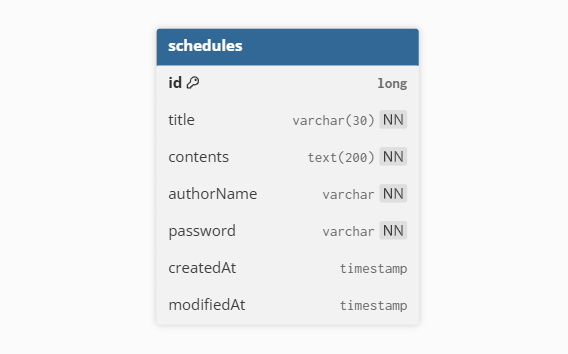

# CH 3. 일정 관리 앱 만들기

## 개요
- 일정(Schedule) CRUD
- 댓글(Comment) 생성

## 규칙
- 일정 1개당 댓글 최대 **10개 제한**
- 댓글은 FK 없이 `scheduleId`(Long)로만 연결
- 모든 응답에서 **password는 제외**
- `createdAt`은 생성 시점 고정, `modifiedAt`은 수정 시점에 갱신 (JPA Auditing)


---

## 공통 사항
### Base URL
- `http://localhost:8080`

### Content-Type
- Request: `application/json`
- Response: `application/json`

### Validation / Error Handling
- 요청 DTO 유효성 검증 실패 시 `400 Bad Request`
- 존재하지 않는 리소스 접근 시 `404 Not Found`
- 비밀번호 불일치 시 `403 Forbidden`
- 제약 위반(예: 댓글 10개 초과) 시 `409 Conflict`
- 예기치 못한 서버 오류 시 `500 Internal Server Error`
---


# API 명세서
### 일정(Schedule) API 명세서
<details>
<summary>일정 API 명세서</summary>
<div markdown="1">

## 1) 일정(Schedule) 생성
### Request
- Method: `POST`
- URL: `/schedules`
- Body
    ```
    {
       "title": "title",   
       "contents": "contents",
       "authorName": "authorName",
       "password": "password"
    }
    ```
### Response
#### ✅ Success
- Status: `201 Created`
- Body
    ```
    {
       "id": 1, 
       "title": "title", 
       "contents": "contents", 
       "authorName: "authorName", 
       "createdAt": "2021-08-23T14:20:00.000+00:00", 
       "modifiedAt": "2021-08-23T14:20:00.000+00:00"
    }
    ```
<br/>

#### ❌ Fail (대표 케이스)
- `400 Bad Request` : 필수값 누락/형식 오류/길이 제한 위반
- `500 Internal Server Error` : 서버 오류

---

## 2) 일정(Schedule) 전체 조회
### Request
- Method: `GET`
- URL:
    - 전체 조회: `/schedules`
    - 작성자 필터: `/schedules?authorName=홍길동`

### Response
#### ✅ Success
- Status: `200 OK`
- Body 예시 (목록)
    ```
    {
       "id": 1, 
       "title": "title", 
       "contents": "contents", 
       "authorName: "authorName", 
       "createdAt": "2021-08-23T14:20:00.000+00:00", 
       "modifiedAt": "2021-08-23T14:20:00.000+00:00"
    }
    ```
  <br/>
#### ❌ Fail (대표 케이스)
- `404 Bad Request` : 쿼리 파라미터 형식 오류 등
- `500 Internal Server Error` : 서버 오류

---

## 3) 일정(Schedule) 단건 조회 (댓글 포함)
### Request
- Method: `GET`
- URL: `/schedules/{scheduleId}`
- Path Parameters: `{scheduleId}`

### Response
#### ✅ Success
- Status: `200 OK`
- Body (단건 + 댓글 포함)
    ```
    {
       "id": 1, 
       "title": "title", 
       "contents": "contents", 
       "authorName: "authorName", 
       "createdAt": "2021-08-23T14:20:00.000+00:00", 
       "modifiedAt": "2021-08-23T14:20:00.000+00:00",
       "comments":
    }
    ```
<br/>

#### ❌ Fail (대표 케이스)
- `404 Not Found` : scheduleId에 해당하는 일정이 없음
- `500 Internal Server Error` : 서버 오류
---

## 4) 일정(Schedule) 수정
### Request
- Method: `PUT`
- URL: `/schedules/{scheduleId}`
- Path Parameters: `{scheduleId}`
- Body
    ```
    {
       "title": "new title",
       "authorName": "new authorName",
       "password": "password"
    }
    ```
### Response
#### ✅ Success
- Status: `200 OK`
- Body
    ```
    {
       "id": 1, 
       "title": "new title",
       "contents": "contents",
       "authorName": "new authorName",
       "createdAt": "2021-08-23T14:20:00.000+00:00", 
       "modifiedAt": "2021-08-23T14:20:00.000+00:00"
    }
    ```

<br/>

#### ❌ Fail (대표 케이스)
- `404 Not Found` : scheduleId에 해당하는 일정이 없음
- `403 Forbidden` : 비밀번호 불일치
- `400 Bad Request` : 요청 바디 검증 실패
- `500 Internal Server Error` : 서버 오류

---

## 5) 일정(Schedule) 삭제
### Request
- Method: `DELETE`
- URL: `/schedules/{scheduleId}`
- Path Parameters: `{scheduleId}`
- Body
    ```
    {
       "password": "password"
    }
    ```
<br/>

### Response
#### ✅ Success
- Status: `204 No Content`
<br/>

#### ❌ Fail (대표 케이스)
- `404 Not Found` : scheduleId에 해당하는 일정이 없음
- `403 Forbidden` : 비밀번호 불일치
- `400 Bad Request` : 요청 바디 검증 실패
- `500 Internal Server Error` : 서버 오류

</div>
</details>

---

### 댓글(Comment) API 명세서
<details>
<summary>댓글 API 명세서</summary>
<div markdown="1">

## 6) 댓글 생성
- 일정 1개당 댓글은 최대 **10개**까지 생성 가능
- FK 없이 `Comment.scheduleId`로만 연결 (무결성은 서비스 로직에서 보장)

### Request
- Method: `POST`
- URL: `/schedules/{scheduleId}/comments`
- Path Parameters: `{scheduleId}`
- Body
    ```
    {
       "contents": "댓글 1번",
       "authorName": "홍길동", 
       "password": "1234"
    }
    ```
### Response
#### ✅ Success
- Status: `201 Created`
- Body
    ```
    {
       "id": 1,
       "scheduleId": 1,
       "contents": "댓글 1번",
       "authorName": "홍길동",
       "createdAt": "2021-08-23T15:00:00",
       "modifiedAt": "2021-08-23T15:00:00"
    }
    ```

#### ❌ Fail (대표 케이스)
- `404 Not Found` : scheduleId에 해당하는 일정이 없음
- `409 Conflict` : 해당 일정의 댓글이 이미 10개 존재
- `400 Bad Request` : 요청 바디 검증 실패
- `500 Internal Server Error` : 서버 오류

</div>
</details>

---

# Postman 실행 결과

### 일정 생성(POST)
<details>
<summary>일정 생성(POST)</summary>
<div markdown="1">

### Success
`201 Created`


### Fail
`400 Bad Request`


`500 Internal Server Error`


</div>
</details>

### 일정 조회(GET)
<details>
<summary>일정 조회(GET)</summary>
<div markdown="1">

### 일정 전체 조회
#### Success
`200 OK`


##### 작성자명 기준 조회


#### Fail
`404 Bad Request`


`500 Internal Server Error`


<br/>

### 일정 단건 조회(댓글 포함)
#### Success
`200 OK`


#### Fail
`404 Not Found`


`500 Internal Server Error`


</div>
</details>

### 일정 수정(PUT)
<details>
<summary>일정 수정(PUT)</summary>
<div markdown="1">

### Success
`200 OK`


### Fail
`404 Not Found`


`403 Forbidden`


`400 Bad Request`


`500 Internal Server Error`


</div>
</details>

### 일정 삭제(DELETE)
<details>
<summary>일정 삭제(DELETE)</summary>
<div markdown="1">

### Success
`204 No Content`


### Fail
`404 Not Found`
`

`403 Forbidden`


`400 Bad Request`


`500 Internal Server Error`


</div>
</details>

### 댓글 생성(POST)
<details>
<summary>댓글 생성(POST)</summary>
<div markdown="1">

수정 필요

</div>
</details>


---

# ERD
### 일정(Schedule)
```
Table schedules {
    id long [primary key]
    title varchar(30) [not null]
    contents text(200) [not null]
    authorName varchar [not null]
    password varchar [not null]
    createdAt timestamp
    modifiedAt timestamp
}
```



### 댓글(Comment) ERD
<br/>
<br/>
