# CH 3. 일정 관리 앱 만들기

## 1. 프로젝트 개요
Spring Boot 기반의 **일정 관리 API**를 구현한 프로젝트입니다.

- 일정(Schedule) CRUD 기능 제공
- 댓글(Comment) 생성 기능 제공
- 단건 조회 시 댓글 목록 함께 조회
- 입력 검증(Validation)과 예외 처리로 안정적인 API 응답 상태코드 제공

---

## 2. 기술 스택(Tech Stack)
- **Language**: Java 17
- **Framework**: Spring Boot (Spring MVC)
- **Data**: Spring Data JPA (Hibernate)
- **DB**: MySQL
- **Build Tool**: Gradle
- **Boilerplate**: Lombok
- **Validation**: Jakarta Validation (`@Valid`, `@NotBlank`, `@Size`)
- **Auditing**: Spring Data JPA Auditing (`createdAt`, `modifiedAt`)
- **Test/Client**: Postman (실행 결과 캡처 포함)

---

## 3. 수행한 단계
`필수 기능`
- [Lv 0] : API 명세 및 ERD 작성
- [Lv 1] : 일정 생성(일정 작성하기)
- [Lv 2] : 일정 조회
  - 전체 일정 조회 
    - 일정 조회 시 작성자명(authorName) 기반 필터링 지원 (`/schedules?authorName=...`)
    - 수정일(modifiedAt) 기준 내림차순 정렬
  - 선택 일정 조회
<br/>
  

- [Lv 3] : 일정 수정
- [Lv 4] : 일정 삭제

`도전 기능`
- [Lv 5] : 댓글 생성(댓글 작성하기)
  - FK 없이 `scheduleId` 값으로만 연결
- [Lv 6] : 일정 단건 조회 업그레이드
  - 일정 단건 조회 시 해당 일정의 댓글 목록을 함께 응답
- [Lv 7] : 유저의 입력에 대한 검증 수행

---

## 3-1. 커스텀 예외 + 예외처리 핸들링

### ⚠️ 필수 · 도전 기능은 아니지만, 만들어보고 싶어서 진행
- **예외 처리로 다양한 상태코드 사용**
  - 404 / 403 / 409 / 500 등 다양한 상태 코드 반환

---

## 4. 기능 목록
### 일정(Schedule)
- 일정 생성
- 일정 전체 조회(작성자명 조건 optional)
- 일정 단건 조회(댓글 포함)
- 일정 수정(비밀번호 일치 시에만)
- 일정 삭제(비밀번호 일치 시에만)

### 댓글(Comment)
- 댓글 생성(일정당 최대 10개, FK 미사용)

---

## 5. 프로젝트 규칙 / 정책
- 일정 1개당 댓글 최대 **10개 제한**
- 댓글은 FK 없이 `scheduleId`(Long)로만 연결
- 모든 응답에서 **password는 제외**
- `createdAt`은 생성 시점 고정, `modifiedAt`은 수정 시점에 갱신 (JPA Auditing)

---

## 6. 📂 클래스 구조

```
ScheduleManager
 ├─ README.md 
 ├─ images
 │    ├─ erd  
 │    └─ postman 
 └─ src
  └─ main
      ├─ resources
      │   └─ application.properties
      └─ java
          └─ com.example.schedulemanager
              │
              ├─ ScheduleManagerApplication
              │    
              ├─ controller 
              │    ├─ GlobalExceptionHandler
              │    └─ ScheduleController
              ├─ dto 
              │   ├─ CreateCommentRequest
              │   ├─ CreateCommentResponse
              │   ├─ CreateScheduleRequest 
              │   ├─ CreateScheduleResponse
              │   ├─ DeleteScheduleRequest 
              │   ├─ GetCommentResponse 
              │   ├─ GetScheduleOneResponse
              │   ├─ GetScheduleResponse
              │   ├─ UpdateScheduleRequest 
              │   └─ UpdateScheduleResponse
              ├─ entity 
              │   ├─ BaseEntity 
              │   ├─ Comment 
              │   └─ Schedule
              ├─ exception
              │   ├─ ConflictException
              │   ├─ ForbiddenException 
              │   └─ ResourceNotFoundException 
              ├─ repository 
              │   ├─ CommentRepository 
              │   └─ ScheduleRepository
              └─ service
                  └─ ScheduleService
```


---

## 7. 실행 방법(Run)

### 7.1 사전 준비
- MySQL 실행
- DB 생성 : `sql CREATE DATABASE scheduleManager;`

### 7.2 application.properties 설정
`src/main/resources/application.properties`에 DB 접속 정보 설정
<details>
<summary>코드 붙여넣기</summary>
<div markdown="1">

    
    spring.datasource.url=jdbc:mysql://localhost:3307/scheduleManager
    spring.datasource.username=root
    spring.datasource.password=12345678
    spring.datasource.driver-class-name=com.mysql.cj.jdbc.Driver
    spring.jpa.hibernate.ddl-auto=create
    spring.jpa.properties.hibernate.dialect=org.hibernate.dialect.MySQLDialect
    spring.jpa.show-sql=true
    spring.jpa.properties.hibernate.format_sql=true

- 포트번호를 3307로 설정한 이유
  - 개발 당시, 로컬에서 3306은 먼저 사용되고 있다고 충돌이 뜨기 때문에 변경해 사용했음.

</div>
</details>

> 참고: `ddl-auto=create`는 실행할 때마다 테이블이 다시 생성됩니다.  
> `update`로 변경 시 데이터가 유지됩니다.

---

## 8. 3 Layer Architecture 기반 주요 클래스 · 역할 설명

### Controller Layer (요청/응답, 라우팅)
- `ScheduleController`
    - `/schedules` 관련 API 엔드포인트 제공
    - `@Valid` 기반 요청값 검증 수행

- `GlobalExceptionHandler` (`@RestControllerAdvice`)
    - 검증 실패/커스텀 예외를 HTTP 상태코드로 변환하여 응답

### Service Layer (비즈니스 로직)
- `ScheduleService`
    - 일정 CRUD 처리
    - 비밀번호 검증 로직 수행
    - 댓글 생성 시 일정 존재 검증 + 댓글 개수 10개 제한 처리
    - 단건 조회 시 댓글 목록 함께 조회 및 DTO 매핑

### Repository Layer (DB 접근)
- `ScheduleRepository`
    - 일정 조회/저장/수정/삭제 DB 접근
    - 작성자명(authorName) 기반 필터링 지원 (/schedules?authorName=...)
    - 정렬
- `CommentRepository`
    - 댓글 저장 DB 접근
    - `scheduleId`별 댓글 개수 카운트 및 목록 조회

---

## 9. CRUD API 구현

| 기능 | Method | URL | 성공 | 실패 |
|---|---|---|---:|---|
| 일정 생성 | POST | `/schedules` | 201 | 400, 500 |
| 일정 전체 조회 | GET | `/schedules` | 200 | 400, 500 |
| 일정 단건 조회(댓글 포함) | GET | `/schedules/{scheduleId}` | 200 | 404, 400, 500 |
| 일정 수정 | PUT | `/schedules/{scheduleId}` | 200 | 404, 403, 400, 500 |
| 일정 삭제 | DELETE | `/schedules/{scheduleId}` | 204 | 404, 403, 400, 500 |
| 댓글 생성 | POST | `/schedules/{scheduleId}/comments` | 201 | 404, 409, 400, 500 |

<br/>

<details>
<summary>공통 사항</summary>
<div markdown="1">

## 공통 사항
### Base URL
- `http://localhost:8080`

### Content-Type
- Request: `application/json`
- Response: `application/json`

### Validation / Error Handling
- 요청 DTO 유효성 검증 실패 시 `400 Bad Request`
- 존재하지 않는 리소스 접근 시 `404 Not Found`
- 비밀번호 불일치 시 `403 Forbidden`
- 제약 위반(예: 댓글 10개 초과) 시 `409 Conflict`
- 예기치 못한 서버 오류 시 `500 Internal Server Error`

</div>
</details>

## 10. API 명세서 
### 일정(Schedule) API 명세서
<details>
<summary>일정 API 명세서</summary>
<div markdown="1">

## 1) 일정(Schedule) 생성
### Request
- Method: `POST`
- URL: `/schedules`
- Body
    ```
    {
       "title": "title",   
       "contents": "contents",
       "authorName": "authorName",
       "password": "password"
    }
    ```
### Response
#### ✅ Success
- Status: `201 Created`
- Body
    ```
    {
       "id": 1, 
       "title": "title", 
       "contents": "contents", 
       "authorName: "authorName", 
       "createdAt": "2021-08-23T14:20:00.000+00:00", 
       "modifiedAt": "2021-08-23T14:20:00.000+00:00"
    }
    ```
<br/>

#### ❌ Fail
- `400 Bad Request` : 필수값 누락/형식 오류/길이 제한 위반
- `500 Internal Server Error` : 서버 오류

---

## 2) 일정(Schedule) 전체 조회
### Request
- Method: `GET`
- URL:
    - 전체 조회: `/schedules`
    - 작성자 필터: `/schedules?authorName=홍길동`

### Response
#### ✅ Success
- Status: `200 OK`
- Body 예시 (목록)
    ```
    {
       "id": 1, 
       "title": "title", 
       "contents": "contents", 
       "authorName: "authorName", 
       "createdAt": "2021-08-23T14:20:00.000+00:00", 
       "modifiedAt": "2021-08-23T14:20:00.000+00:00"
    }
    ```
  <br/>
#### ❌ Fail
- `404 Bad Request` : 쿼리 파라미터 형식 오류 등
- `500 Internal Server Error` : 서버 오류

---

## 3) 일정(Schedule) 단건 조회 (댓글 포함)
### Request
- Method: `GET`
- URL: `/schedules/{scheduleId}`
- Path Parameters: `{scheduleId}`

### Response
#### ✅ Success
- Status: `200 OK`
- Body (단건 + 댓글 포함)
    ```
    {
       "id": 1, 
       "title": "title", 
       "contents": "contents", 
       "authorName: "authorName", 
       "createdAt": "2021-08-23T14:20:00.000+00:00", 
       "modifiedAt": "2021-08-23T14:20:00.000+00:00",
       "comments":
    }
    ```
<br/>

#### ❌ Fail
- `404 Not Found` : scheduleId에 해당하는 일정이 없음
- `500 Internal Server Error` : 서버 오류
---

## 4) 일정(Schedule) 수정
### Request
- Method: `PUT`
- URL: `/schedules/{scheduleId}`
- Path Parameters: `{scheduleId}`
- Body
    ```
    {
       "title": "new title",
       "authorName": "new authorName",
       "password": "password"
    }
    ```
### Response
#### ✅ Success
- Status: `200 OK`
- Body
    ```
    {
       "id": 1, 
       "title": "new title",
       "contents": "contents",
       "authorName": "new authorName",
       "createdAt": "2021-08-23T14:20:00.000+00:00", 
       "modifiedAt": "2021-08-23T14:20:00.000+00:00"
    }
    ```

<br/>

#### ❌ Fail
- `404 Not Found` : scheduleId에 해당하는 일정이 없음
- `403 Forbidden` : 비밀번호 불일치
- `400 Bad Request` : 요청 바디 검증 실패
- `500 Internal Server Error` : 서버 오류

---

## 5) 일정(Schedule) 삭제
### Request
- Method: `DELETE`
- URL: `/schedules/{scheduleId}`
- Path Parameters: `{scheduleId}`
- Body
    ```
    {
       "password": "password"
    }
    ```
<br/>

### Response
#### ✅ Success
- Status: `204 No Content`
<br/>

#### ❌ Fail
- `404 Not Found` : scheduleId에 해당하는 일정이 없음
- `403 Forbidden` : 비밀번호 불일치
- `400 Bad Request` : 요청 바디 검증 실패
- `500 Internal Server Error` : 서버 오류

</div>
</details>

---

### 댓글(Comment) API 명세서
<details>
<summary>댓글 API 명세서</summary>
<div markdown="1">

## 6) 댓글 생성
- 일정 1개당 댓글은 최대 **10개**까지 생성 가능
- FK 없이 `Comment.scheduleId`로만 연결 (무결성은 서비스 로직에서 보장)

### Request
- Method: `POST`
- URL: `/schedules/{scheduleId}/comments`
- Path Parameters: `{scheduleId}`
- Body
    ```
    {
       "contents": "댓글 1번",
       "authorName": "홍길동", 
       "password": "1234"
    }
    ```
### Response
#### ✅ Success
- Status: `201 Created`
- Body
    ```
    {
       "id": 1,
       "scheduleId": 1,
       "contents": "댓글 1번",
       "authorName": "홍길동",
       "createdAt": "2021-08-23T15:00:00",
       "modifiedAt": "2021-08-23T15:00:00"
    }
    ```

#### ❌ Fail
- `404 Not Found` : scheduleId에 해당하는 일정이 없음
- `409 Conflict` : 해당 일정의 댓글이 이미 10개 존재
- `400 Bad Request` : 요청 바디 검증 실패
- `500 Internal Server Error` : 서버 오류

</div>
</details>

---

## 11. Postman 실행 결과

### 일정 생성(POST)
<details>
<summary>일정 생성(POST)</summary>
<div markdown="1">

### Success
`201 Created`
<br/>
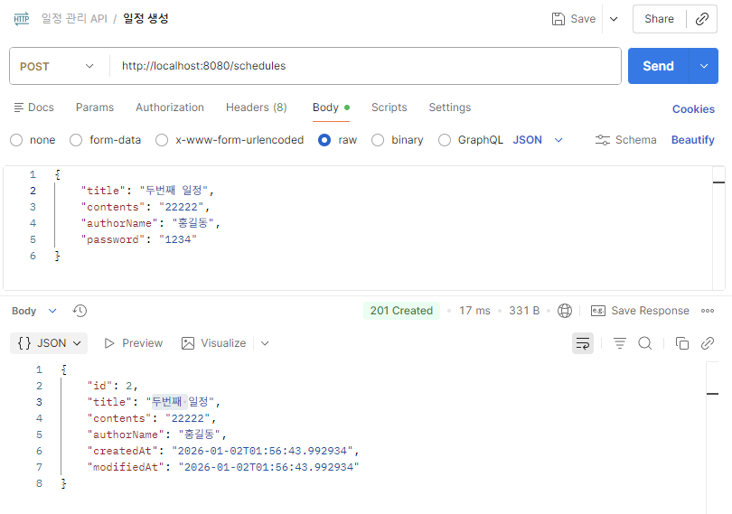

### Fail
`400 Bad Request`
<br/>
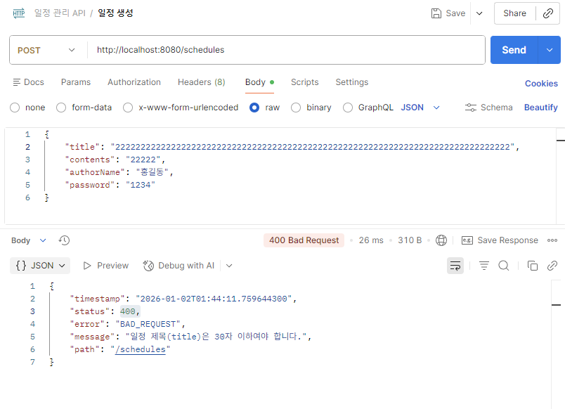

`500 Internal Server Error`
<br/>
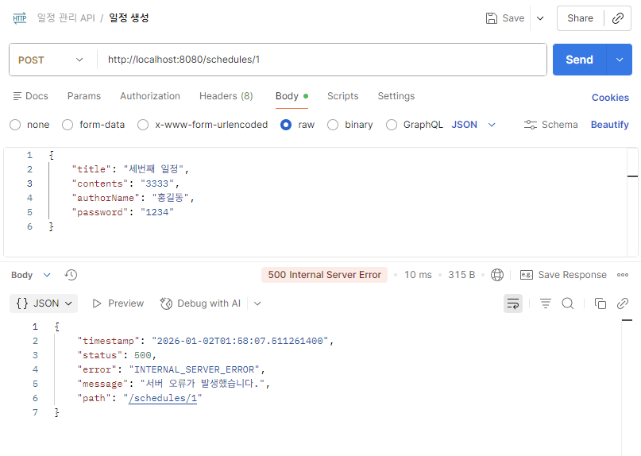

</div>
</details>

### 일정 조회(GET)
<details>
<summary>일정 조회(GET)</summary>
<div markdown="1">

### 일정 전체 조회
### Success
`200 OK`
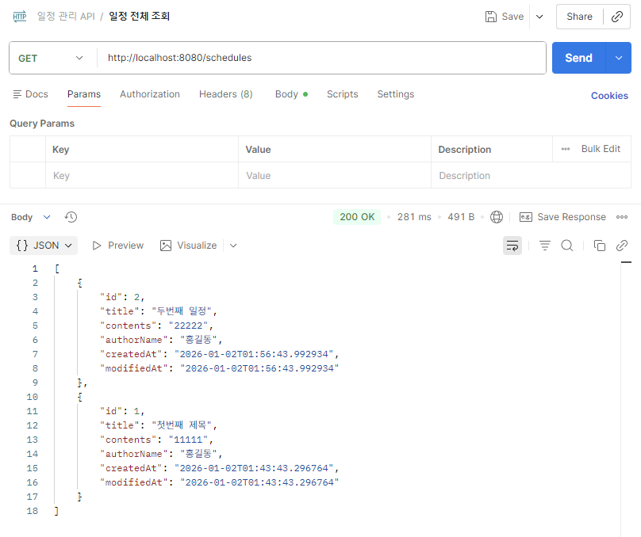

### 작성자명 기준 조회
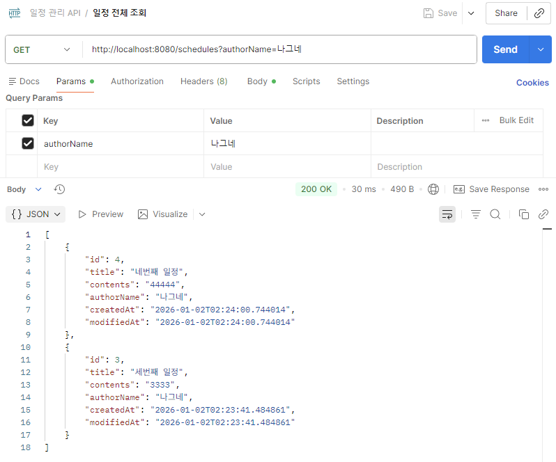

### Fail
`404 Bad Request`
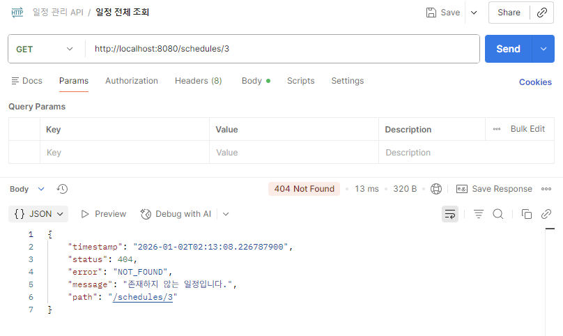

`500 Internal Server Error`
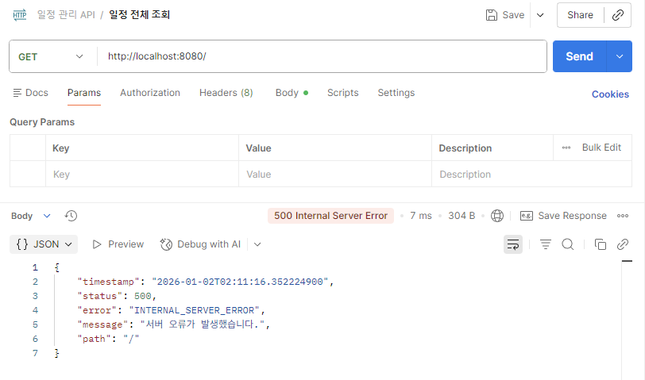

<br/>

### 일정 단건 조회(댓글 포함)
### Success
`200 OK`
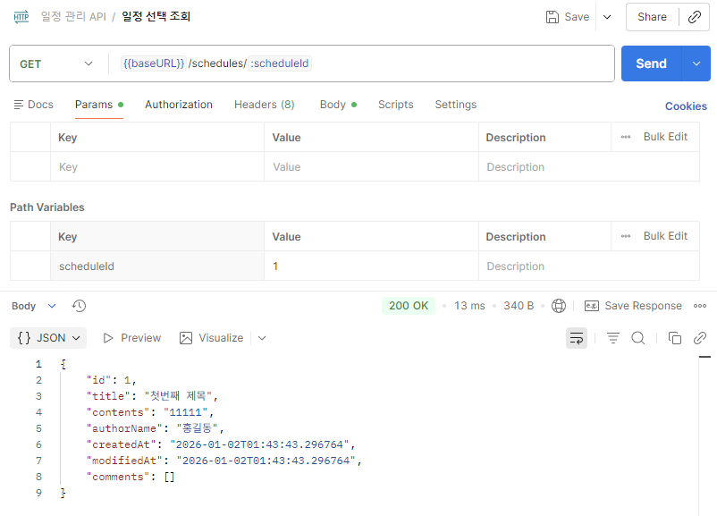

### 댓글도 함께 조회됨
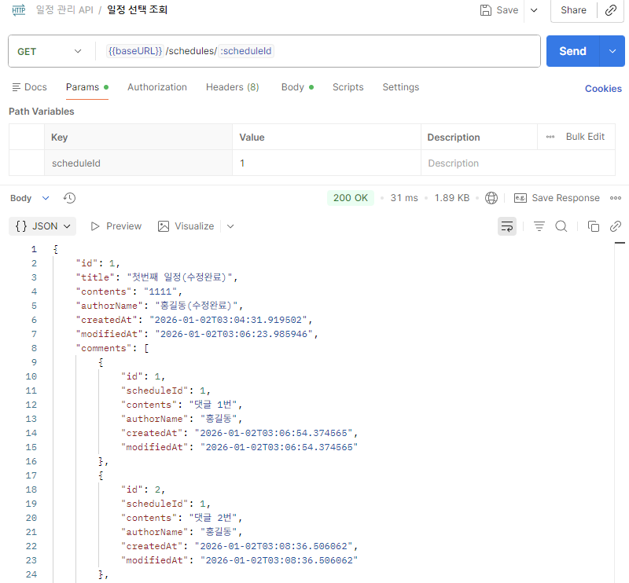

### Fail
`404 Not Found`
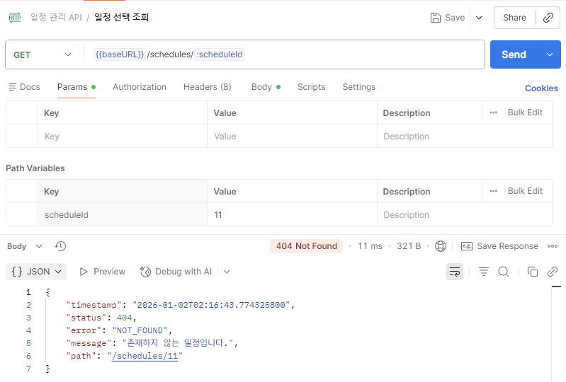

`500 Internal Server Error`
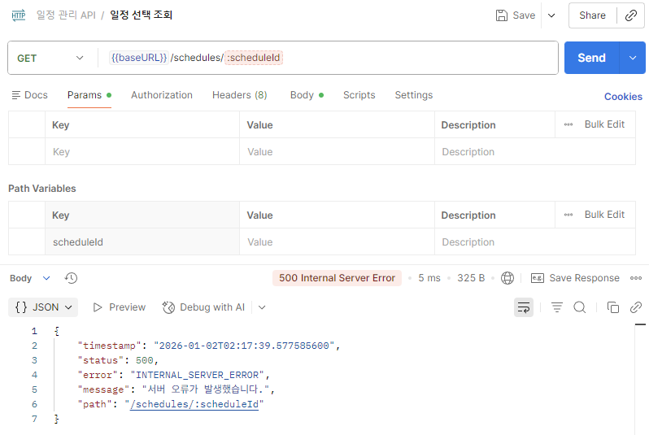

</div>
</details>

### 일정 수정(PUT)
<details>
<summary>일정 수정(PUT)</summary>
<div markdown="1">

### Success
`200 OK`
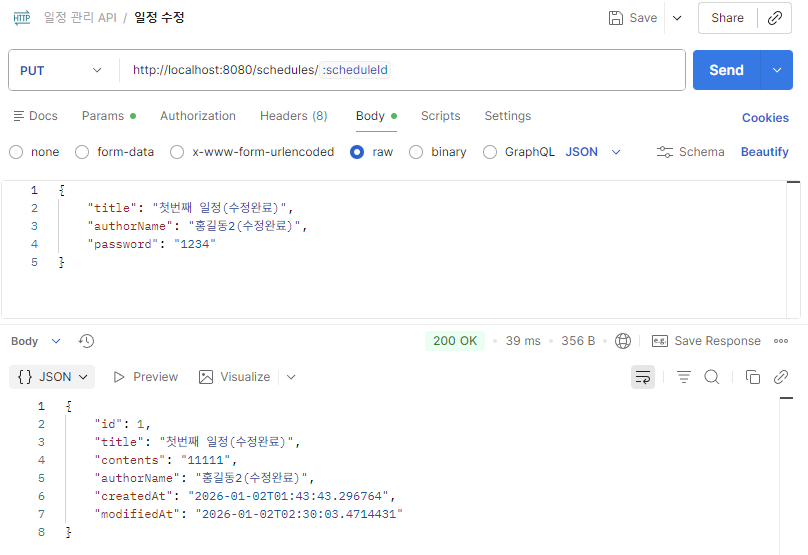


### Fail
`404 Not Found`


`403 Forbidden`
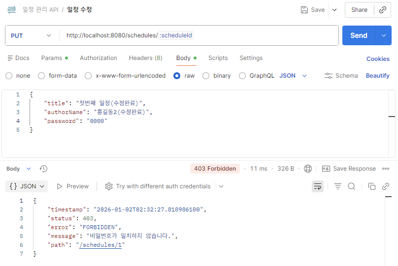

`400 Bad Request`
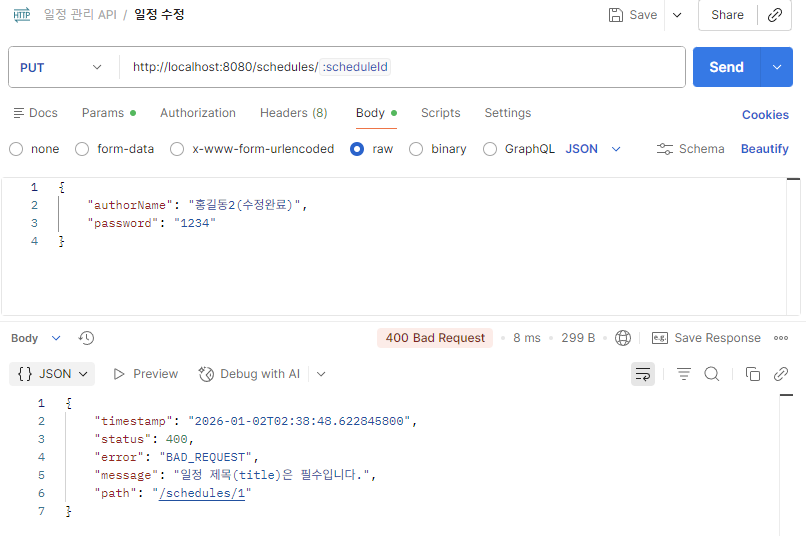

`500 Internal Server Error`
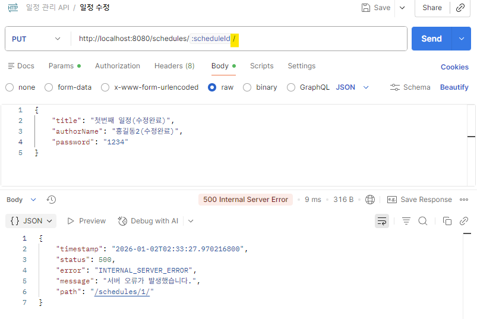


</div>
</details>

### 일정 삭제(DELETE)
<details>
<summary>일정 삭제(DELETE)</summary>
<div markdown="1">

### Success
`204 No Content`
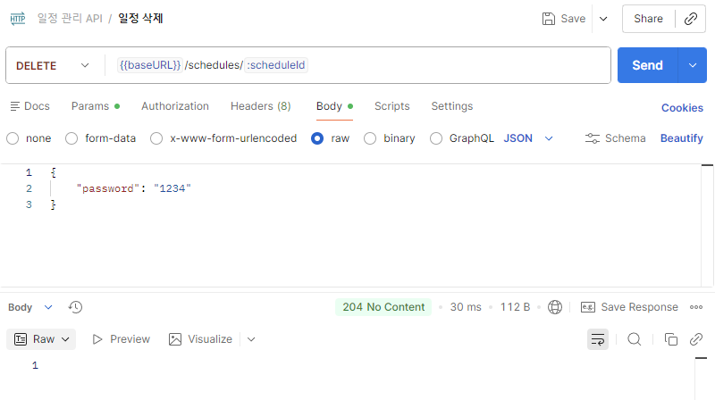

### Fail
`404 Not Found`
`

`403 Forbidden`


`400 Bad Request`
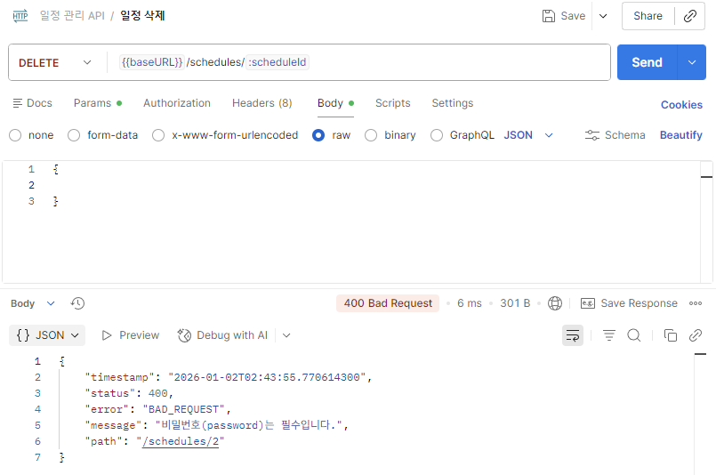

`500 Internal Server Error`
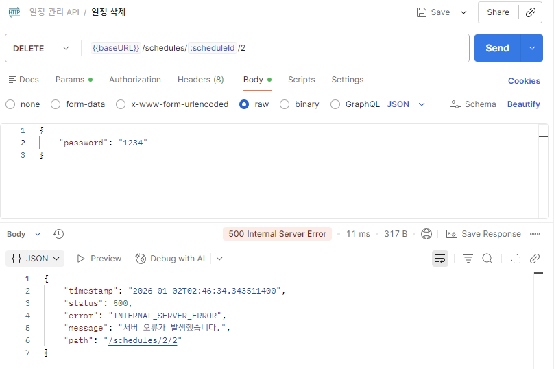

</div>
</details>

### 댓글 생성(POST)
<details>
<summary>댓글 생성(POST)</summary>
<div markdown="1">

### Success
`201 Created`
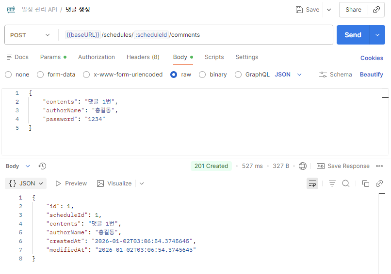

### Fail
`404 Not Found`


`409 Conflict`


`400 Bad Request`
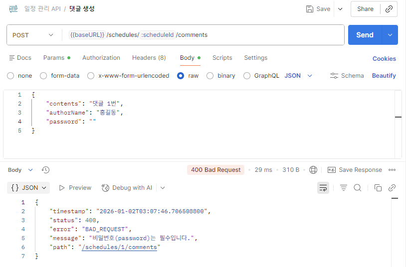

`500 Internal Server Error`


</div>
</details>


---

## 12. ERD
### 1) Schedules (일정)

| 컬럼명 | 타입      | 제약 | 설명 |
|---|---------|---|---|
| id | LONG    | PK, AUTO_INCREMENT | 일정 고유 ID |
| title | VARCHAR(30) | NOT NULL | 일정 제목 (최대 30자) |
| contents | VARCHAR(200) | NOT NULL | 일정 내용 (최대 200자) |
| author_name | VARCHAR | NOT NULL | 작성자명 |
| password | VARCHAR | NOT NULL | 비밀번호 (응답 제외, 검증용) |
| created_at | DATETIME | (Auditing) | 생성 시각 (수정 불가) |
| modified_at | DATETIME | (Auditing) | 수정 시각 |

---

### 2) Comments (댓글)  ※ FK 미사용

| 컬럼명 | 타입 | 제약 | 설명 |
|---|---|---|---|
| id | LONG | PK, AUTO_INCREMENT | 댓글 고유 ID |
| schedule_id | LONG | NOT NULL | 댓글이 달린 일정 ID (**FK 없이 값으로만 관리**) |
| contents | VARCHAR(100) | NOT NULL | 댓글 내용 (최대 100자) |
| author_name | VARCHAR | NOT NULL | 작성자명 |
| password | VARCHAR | NOT NULL | 비밀번호 (응답 제외, 검증용) |
| created_at | DATETIME | (Auditing) | 생성 시각 |
| modified_at | DATETIME | (Auditing) | 수정 시각 |

---

### 관계
**1 : N (Schedule : Comment)** 
- 단, 외래키(FK)는 사용하지 않음  
  → `comments.schedule_id`는 FK가 아니라 값으로만 저장
- **일정 1개당 댓글 최대 10개**  
  → **Service 로직(countByScheduleId)으로 제한**

---

### ERD 다이어그램


---

## 13. 3 Layer Architecture & Annotation

## 3 Layer Architecture

### `Controller`


### `Service`


### `Repository`


## Annotation

### `@RequestParam`


### `@PathVariable`


### `@RequestBody`

---

## 14. 트러블슈팅 TIL


---


<br/>
<br/>
